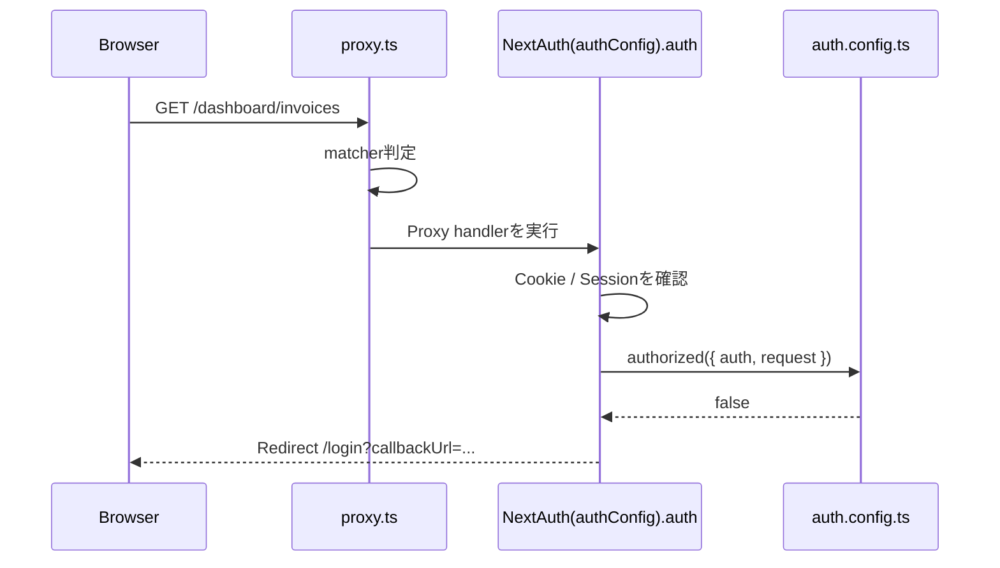
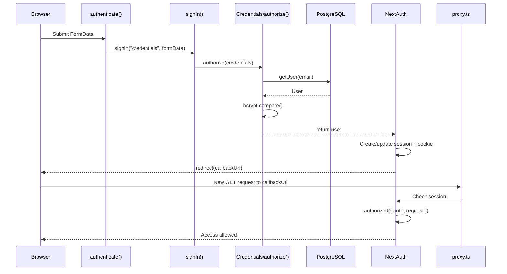
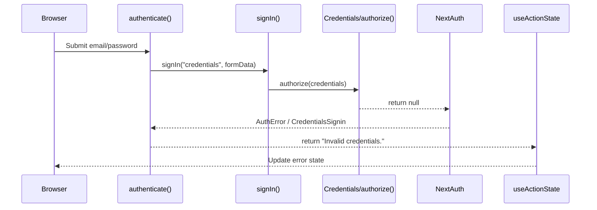

# Next.js Authentication - Auth.js / NextAuth の認証フロー

> Visual review: [認証フローを短時間で復習する](visuals/nextjs-authentication.html)

## 30-second summary

今回理解した認証処理は、大きく2本に分かれる。

```text
Authentication
= ログイン情報が本当にそのユーザーのものか確認する

Authorization
= ログイン済みユーザーを、そのページへ通してよいか確認する
```

Next.js Learn のコードでは主に次のように分担されている。

| ファイル / 処理 | 主な役割 |
|---|---|
| `proxy.ts` | リクエスト時のページ保護の入口 |
| `auth.config.ts` | `authorized()` などアクセスルール |
| `auth.ts` | Credentials Provider とログイン認証 |
| `authenticate()` | Login Form と `signIn()` をつなぐ Server Action |
| `authorize()` | email/password を検証する Authentication |
| `authorized()` | 現在のユーザーをページへ通すか判断する Authorization |

一番重要なのは、ログイン成功後に直接Dashboardが表示されるのではなく、

```text
ログイン成功
→ Session / Cookie作成
→ redirect
→ 新しいHTTP Request
→ proxy.ts
→ authorized()
→ 今度はログイン済みなので通過
```

という流れになっていること。

---

## Why this was confusing

Authenticationの章に入ると、次のようなコードが一気に登場した。

```ts
export default NextAuth(authConfig).auth;
```

```ts
authorized({ auth, request: { nextUrl } }) {
  ...
}
```

```ts
await signIn('credentials', formData);
```

```ts
async authorize(credentials) {
  ...
}
```

最初はこれらが「NextAuth専用のテンプレート」に見えてしまった。

特に分からなかったのは、

- 誰が `authorized()` を呼んでいるのか
- `auth` や `request` はどこから来るのか
- `proxy.ts` は普通のファイルなのか
- `NextAuth(authConfig).auth` は何を返しているのか
- `signIn()` の引数と戻り値は何なのか
- `authorize()` が返した `user` はどこへ行くのか
- ログイン成功後、なぜ再びページへアクセスできるようになるのか

という「コードの呼び出し関係」だった。

今回の学習では、個々のAPIを暗記するのではなく、

> 誰が呼ぶ？  
> 何を渡す？  
> 何を返す？  
> 次にどのRequestが発生する？

を追うことで理解した。

---

# Final mental model

## Authentication と Authorization

### Authentication

```text
Are you really this user?
```

今回のコードでは、

```text
Login Form
→ authenticate()
→ signIn("credentials")
→ Credentials Provider
→ authorize()
→ Zod
→ DB
→ bcrypt.compare()
→ user / null
```

が担当する。

主な実装場所は `auth.ts`。

### Authorization

```text
May this user access this page?
```

今回のコードでは、

```text
HTTP Request
→ proxy.ts
→ NextAuth(authConfig).auth
→ Session確認
→ authorized()
→ true / false / redirect
```

が担当する。

主な実装場所は `proxy.ts` と `auth.config.ts`。

---

# End-to-end flow

## 1. 未ログイン状態で保護ページへアクセス

例えば、

```text
GET /dashboard/invoices
```

というRequestが発生する。



ここで重要なのは、`matcher` の役割。

`matcher` は、

> 認証が必要か？

を直接判定しているわけではない。

正しくは、

> このRequestに対してProxyを実行するか？

を決めている。

```text
Request
   ↓
matcher
   ├─ 対象外 → Proxyを実行せず次へ
   └─ 対象   → proxy.tsを実行
```

---

## 2. `proxy.ts`

```ts
import NextAuth from 'next-auth';
import { authConfig } from './auth.config';

export default NextAuth(authConfig).auth;

export const config = {
  matcher: ['/((?!api|_next/static|_next/image|.*\\.png$).*)'],
};
```

`proxy.ts` はNext.jsが認識する特別なファイル規約。

普通の、

```text
utils.ts
hello.ts
auth.config.ts
```

とは違い、Proxy対象のHTTP Requestが来るとNext.js側から利用される。

### `NextAuth(authConfig).auth`

`NextAuth()` は設定を受け取り、認証関連機能を作る。

概念的には、

```ts
const configuredAuth = NextAuth(authConfig);

const authHandler = configuredAuth.auth;

export default authHandler;
```

と考えると分かりやすい。

これは概念的な展開であり、NextAuth内部ソースをそのまま書いたものではない。

`.auth` はProxyとして使える認証処理用関数。

Proxyとして動作すると、

```text
Request
→ Cookie / Session確認
→ authConfig.callbacks.authorized(...)
```

という流れにつながる。

---

# `auth.config.ts`

```ts
import type { NextAuthConfig } from 'next-auth';

export const authConfig = {
  pages: {
    signIn: '/login',
  },
  callbacks: {
    authorized({ auth, request: { nextUrl } }) {
      const isLoggedIn = !!auth?.user;
      const isOnDashboard =
        nextUrl.pathname.startsWith('/dashboard');

      if (isOnDashboard) {
        if (isLoggedIn) return true;
        return false;
      } else if (isLoggedIn) {
        return Response.redirect(
          new URL('/dashboard', nextUrl)
        );
      }

      return true;
    },
  },
  providers: [],
} satisfies NextAuthConfig;
```

## `authConfig`

NextAuthに渡す設定オブジェクト。

`auth.config.ts` というファイル名自体はNext.jsの特別なファイル規約ではない。

## `satisfies NextAuthConfig`

このオブジェクトが `NextAuthConfig` の構造を満たしているか、TypeScriptにチェックさせる。

Runtime Validationではない。

---

# `authorized()` は誰が呼ぶ？

```ts
authorized({ auth, request: { nextUrl } })
```

を自分のコードから直接呼んでいるわけではない。

流れは、

```text
HTTP Request
→ proxy.ts
→ NextAuth(authConfig).auth
→ NextAuthがSessionを確認
→ NextAuthがauthorized()を呼ぶ
```

となる。

---

## 引数 `auth`

ここでの `auth` はCookieそのものではない。

NextAuthがCookie / JWT / Sessionなどを処理した結果として得られる、現在の認証情報。

ログイン済みなら概念的に、

```ts
{
  user: {
    id: '...',
    email: '...'
  }
}
```

のような情報になる。

未ログインなら `null` などになる。

---

## 引数 `request`

現在のHTTP Request。

例えば、

- URL
- pathname
- method
- headers
- cookies

などのRequest情報を持つ。

---

## `request: { nextUrl }`

これはNextAuth独自の構文ではなくJavaScriptの分割代入。

概念的には、

```ts
authorized(data) {
  const auth = data.auth;
  const nextUrl = data.request.nextUrl;
}
```

と同じ。

---

## `!!auth?.user`

```ts
const isLoggedIn = !!auth?.user;
```

### `?.`

Optional Chaining。

`auth` が `null` でも、

```ts
auth.user
```

のようなアクセスエラーを発生させず、

```ts
auth?.user
```

なら `undefined` として扱える。

### `!!`

値をbooleanへ変換する。

```ts
!!undefined // false
!!null      // false
!!{}        // true
```

つまり、

```ts
!!auth?.user
```

は、

> 現在ログインユーザー情報が存在するか？

をbooleanにしている。

---

## Dashboard判定

```ts
const isOnDashboard =
  nextUrl.pathname.startsWith('/dashboard');
```

例えば、

```text
/dashboard
/dashboard/invoices
/dashboard/customers
```

なら `true`。

---

## `authorized()` の4パターン

| Dashboard | Logged in | 結果 |
|---|---:|---|
| Yes | Yes | `true` |
| Yes | No | `false` → Login |
| No | Yes | `/dashboard`へredirect |
| No | No | `true` |

最後の、

```ts
return true;
```

は、

```text
Dashboardではない
+
ログインしていない
```

という通常の公開ページを表示させるために必要。

---

# `pages.signIn` と `callbackUrl`

`authorized()` が `false` を返した場合、NextAuthは、

```ts
pages: {
  signIn: '/login',
}
```

を使ってLoginページへ移動させる。

ただし、元々アクセスしたかったページを失わないように、

```text
/login?callbackUrl=/dashboard/invoices
```

のようなURLになる。

`callbackUrl` は、

> ログインに成功した後に戻りたい場所

と理解できる。

---

# Login Form

Login画面では、

```ts
const callbackUrl =
  searchParams.get('callbackUrl') || '/dashboard';
```

として、URLから元の目的地を取得する。

`callbackUrl` がない場合は `/dashboard` をデフォルトにする。

その値をhidden inputへ入れる。

```tsx
<input
  type="hidden"
  name="redirectTo"
  value={callbackUrl}
/>
```

そのため、Form submit時の `FormData` には概念的に、

```text
email
password
redirectTo
```

が含まれる。

---

# `useActionState` と `authenticate()`

```tsx
const [
  errorMessage,
  formAction,
  isPending,
] = useActionState(
  authenticate,
  undefined
);

<form action={formAction}>
```

`useActionState` を使用しているため、Form submit時にReactが概念的に、

```ts
authenticate(
  previousState,
  formData
);
```

と呼ぶ。

## `prevState`

前回のAction結果。

初回は、

```ts
undefined
```

。

## `formData`

form内のinputから作られた `FormData`。

---

# `authenticate()`

```ts
'use server';

import { signIn } from '@/auth';
import { AuthError } from 'next-auth';

export async function authenticate(
  prevState: string | undefined,
  formData: FormData,
) {
  try {
    await signIn('credentials', formData);
  } catch (error) {
    if (error instanceof AuthError) {
      switch (error.type) {
        case 'CredentialsSignin':
          return 'Invalid credentials.';
        default:
          return 'Something went wrong.';
      }
    }

    throw error;
  }
}
```

このServer Action自身がPasswordを検証しているわけではない。

役割は、

```text
Login Form
→ authenticate()
→ signIn()
→ NextAuth
```

をつなぐことと、失敗時のAuthErrorを画面用Stateへ変換すること。

---

# `signIn('credentials', formData)`

## 第一引数

```ts
'credentials'
```

使用するAuth Providerを指定する。

`auth.ts` では、

```ts
Credentials({
  async authorize(credentials) {
    ...
  }
})
```

を登録しているため、`credentials` Providerが選択される。

## 第二引数

```ts
formData
```

には、

```text
email
password
redirectTo
```

などが含まれる。

そのうちemail/passwordはCredentials認証へ進み、`redirectTo` はログイン成功後の移動先として使われる。

---

# `auth.ts`

```ts
export const {
  auth,
  signIn,
  signOut,
} = NextAuth({
  ...authConfig,
  providers: [
    Credentials({
      async authorize(credentials) {
        ...
      },
    }),
  ],
});
```

`authConfig` の設定をSpreadして再利用し、その上でCredentials Providerを追加する。

元の `authConfig` にある、

```ts
providers: []
```

は後から書かれた `providers` によって上書きされる。

---

# `authorize()`

```ts
async authorize(credentials) {
  ...
}
```

ここはAuthentication。

> このemail/passwordは本当に正しいユーザーか？

を確認する。

`auth.config.ts` の `authorized()` とは別の処理。

```text
authorize()
= Authentication

authorized()
= Authorization
```

名前が似ているので非常に紛らわしい。

---

# Zod

```ts
const parsedCredentials = z
  .object({
    email: z.string().email(),
    password: z.string().min(6),
  })
  .safeParse(credentials);
```

ここでは、

```text
emailはstringか
email形式か
passwordはstringか
6文字以上か
```

などをRuntimeで検証する。

`email()` はメールアドレスが実在するか確認しているわけではない。

---

# TypeScript `User`

```ts
import type { User } from '@/app/lib/definitions';
```

これはRuntime Validationではない。

TypeScriptへ、

> `User` はこういう構造として扱う

と型情報を与えるもの。

同様に、

```ts
sql<User[]>
```

も、DB結果をRuntimeで自動検証して `User` に変換しているわけではない。

---

# `getUser()`

```ts
async function getUser(
  email: string
): Promise<User | undefined> {
  const user =
    await sql<User[]>`
      SELECT * FROM users
      WHERE email=${email}
    `;

  return user[0];
}
```

SQL結果は複数行を返せるため配列になる。

例えば、

```ts
[
  {
    id: '...',
    email: '...',
    password: '...'
  }
]
```

なので、

```ts
user[0]
```

で最初のUserを取得する。

存在しなければ配列が空なので `undefined`。

---

# bcrypt

```ts
const passwordsMatch =
  await bcrypt.compare(
    password,
    user.password
  );
```

比較しているのは、

```text
password
= 今入力された平文Password

user.password
= DBに保存されているbcrypt Hash
```

ここでDB保存用の新しいHashを生成しているわけではない。

---

# `return user` / `return null`

認証成功なら、

```ts
return user;
```

認証失敗なら、

```ts
return null;
```

Credentials Providerはこの結果をNextAuthへ返す。

ただし、

```text
return user
→ そのまま別の場所の auth.user に直接代入
```

ではない。

正しくは、

```text
authorize()
→ return user
→ NextAuthが認証成功と判断
→ Session / JWT / Cookie処理
→ 後続Request
→ NextAuthがSessionを読み取る
→ auth.userとして利用可能
```

という流れ。

---

# Successful login flow



最大のポイントは、

> Login成功後に、新しいHTTP Requestが発生する

こと。

だから `proxy.ts` と `authorized()` がもう一度動く。

今度はSession/Cookieが存在するため、

```ts
!!auth?.user
```

がtrueになり、Dashboardへのアクセスが許可される。

---

# Failed login flow



認証失敗時は通常の成功redirectには進まず、

```ts
return 'Invalid credentials.';
```

が `useActionState` のStateとして画面へ戻る。

---

# `signIn()` の「戻り値」の考え方

今回のLearnでは、

```ts
await signIn('credentials', formData);
```

としているが、成功時の値を、

```ts
const result = ...
```

として使っていない。

今回の使い方では、

```text
signIn()
→ 認証
→ Session/Cookie処理
→ redirect
```

という制御や副作用が重要。

Next.jsの `redirect()` は通常の値returnとは異なる制御フローを使うため、

```ts
catch (error) {
  if (error instanceof AuthError) {
    ...
  }

  throw error;
}
```

として、認証エラー以外を勝手に握りつぶさない。

---

# What I misunderstood / corrected

## 1. `matcher` は認証要否を判定する

最初の理解：

```text
matcher
→ 認証する必要があるか判断
```

修正後：

```text
matcher
→ そもそもProxyをこのRequestで実行するか判断
```

認証可否はその後の `authorized()` などが担当する。

## 2. `auth` はCookieそのもの

修正後：

`authorized({ auth })` の `auth` は、NextAuthがCookie / Session / JWTなどを処理して得た認証情報。

## 3. `return user` するとすぐ `.user` に入る

修正後：

```text
return user
→ NextAuth
→ Session/JWT/Cookie
→ 次のRequest
→ auth.user
```

という段階がある。

## 4. `User` 型がDB結果を検証する

修正後：

TypeScriptの `User` はcompile-timeの型情報。

Runtime Validationをしたい場合はZodなど別の仕組みが必要。

## 5. bcryptで入力PasswordをHash化して比較する

より正確には、

```ts
bcrypt.compare(plainPassword, storedHash)
```

で、入力された平文Passwordと保存済みHashが対応しているかを確認する。

## 6. `safeParse()` は特殊なラムダ式

修正後：

Zod Schemaに対する普通のメソッド呼び出し。

---

# File responsibilities

## `proxy.ts`

```text
HTTP Request時のAuthorization入口
```

- Next.jsの特別なファイル規約
- `matcher`
- `NextAuth(authConfig).auth`

## `auth.config.ts`

```text
共通Auth設定 + ページアクセスルール
```

- `pages.signIn`
- `callbacks.authorized`
- `providers: []`

## `auth.ts`

```text
Login Authentication
```

- Credentials Provider
- `authorize()`
- Zod
- PostgreSQL
- bcrypt
- `auth`
- `signIn`
- `signOut`

## `authenticate()`

```text
Login Form と NextAuth signIn をつなぐServer Action
```

- `formData` を受け取る
- `signIn('credentials', formData)`
- AuthErrorを画面用Stateへ変換

---

# Common pitfalls

- `authorize()` と `authorized()` を同じものだと思わない。
- `authConfig` は設定Objectであり、自分で実行する関数ではない。
- `auth.config.ts` は特別なNext.jsファイル名ではない。
- `proxy.ts` はNext.jsのファイル規約。
- `request: { nextUrl }` はJavaScriptの分割代入。
- TypeScript型とRuntime Validationを混同しない。
- Login成功後のredirectは「同じRequestの続き」ではなく、新しいRequestにつながる。
- `callbackUrl` はログイン成功後に戻る目的地。
- `redirectTo` hidden inputによって、その目的地をFormData経由でNextAuthへ渡している。

---

# Review questions

1. `matcher` と `authorized()` はそれぞれ何を判断しているか？
2. `NextAuth(authConfig).auth` は `proxy.ts` でどのような役割を持つか？
3. `authorized({ auth, request })` の `auth` は誰が作るのか？
4. `authorize()` と `authorized()` の違いを、Authentication / Authorizationを使って説明できるか？
5. `authorize()` が `return user` した後、なぜそのUserが後続Requestの `auth.user` として利用できるようになるのか？
6. Login成功後に、なぜ `proxy.ts` が再び実行されるのか？
7. `callbackUrl` と `redirectTo` は、ログインフローの中でどのように受け渡されるか？
